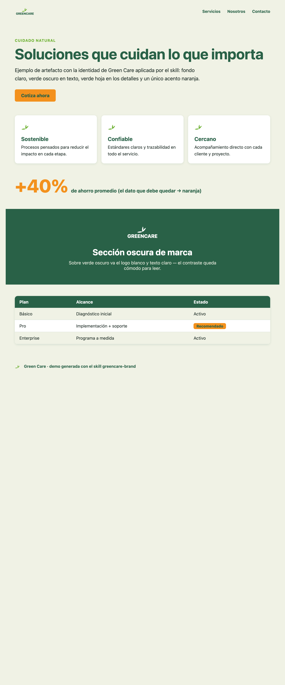
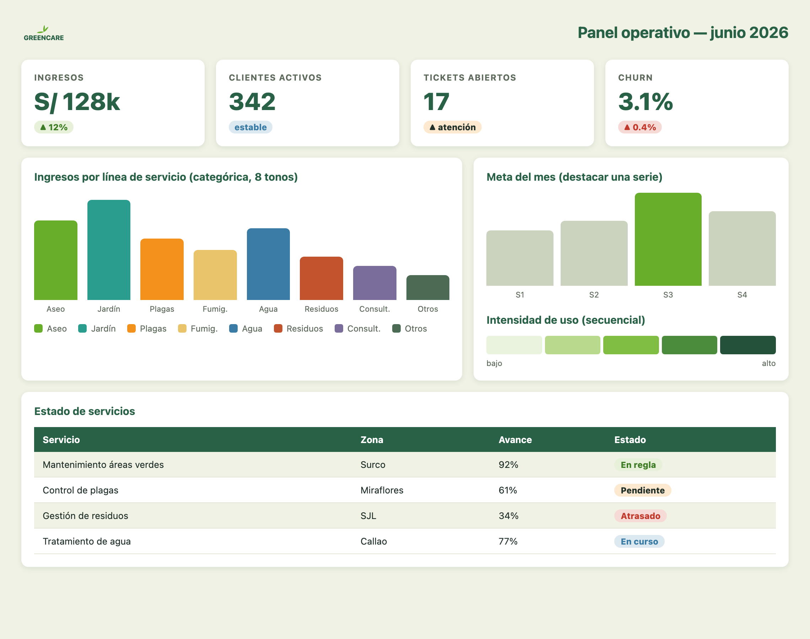

# Green Care — marca visual

Skill de marca para que cualquier cosa que generes con Claude salga con la identidad de
**Green Care**: coherente, legible y reconocible, sin importar el formato (documentos, slides,
dashboards, HTML, correos, imágenes).

## Vista rápida

| One-pager | Dashboard |
|-----------|-----------|
|  |  |

## Qué trae

- **Paleta**: verde oscuro `#296147`, verde hoja `#68AE2A`, naranja `#F3911D`, crema `#F0F2E5`, más una **paleta funcional** (categórica, secuencial, divergente, neutros y estados) para gráficos y dashboards.
- **Tipografía**: system font stack (cero dependencias).
- **Logo**: SVG en variantes (color, blanco, una tinta, solo ícono).
- **Reglas**: contraste accesible, un acento naranja por vista, esquinas siempre redondeadas.
- **Recetas por artefacto**: HTML/dashboard, documentos, slides, hojas de cálculo, imágenes, correos.

## Instalar en Claude Code (plugin)

```bash
/plugin marketplace add sv-build/greencare-brand
/plugin install greencare-brand@greencare
```

Luego el skill se activa solo cuando pidas algo con la marca de Green Care.
Para actualizar a la última versión: `/plugin marketplace update`.

## Usar en Claude.ai / Cowork

Ahí no se jala del repo: se sube el skill como archivo.
Descarga la carpeta `plugins/greencare-brand/skills/greencare-brand/`, comprímela en `.zip`
(con el `SKILL.md` dentro) y súbela en *Settings → Skills → Upload*.

## Estructura

```
.claude-plugin/marketplace.json        # catálogo del marketplace
plugins/greencare-brand/
  .claude-plugin/plugin.json           # manifiesto del plugin
  skills/greencare-brand/
    SKILL.md                           # skill (entrada)
    assets/                            # logo (svg), tokens.css, hero
    references/                        # tokens, artifacts, data-viz
```
